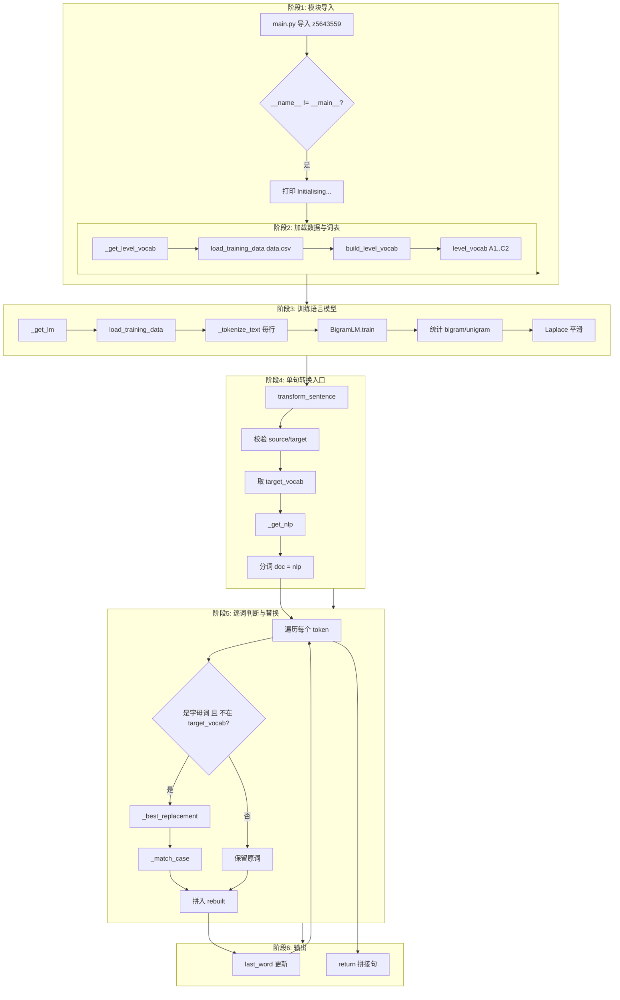
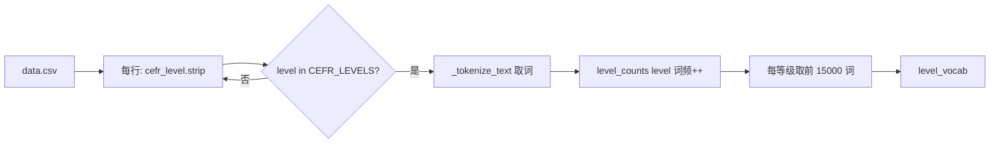
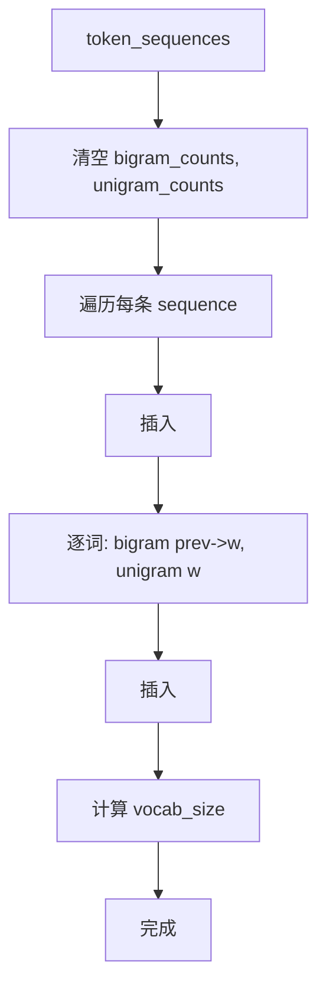
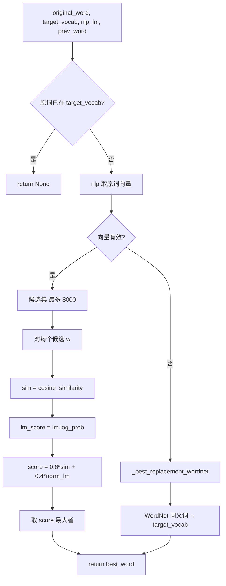
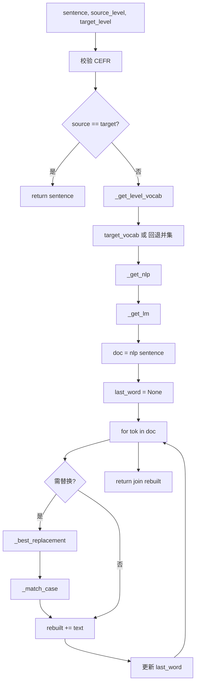
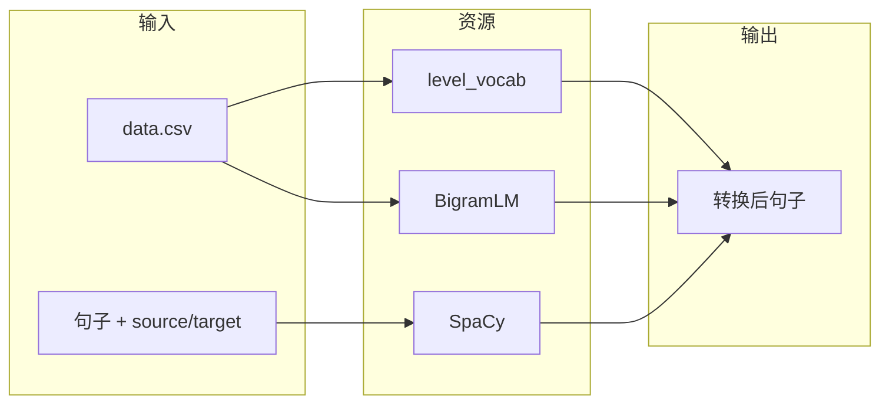

# z5643559 项目流程图

根据 `z5643559.py` 整理的六阶段流程图。

---

## 1. 程序总览（六阶段）

---

## 2. 阶段2：构建等级词表 (build_level_vocab)

---

## 3. 阶段3：Bigram LM 训练 (BigramLM.train)

---

## 4. 选替换词 (_best_replacement)

---

## 5. transform_sentence 主流程

---

## 6. 数据与依赖关系

---

以上六图分别对应：**总览六阶段**、**等级词表构建**、**LM 训练**、**替换词选择**、**transform_sentence 主流程**、**数据与依赖**。可用支持 Mermaid 的编辑器（如 VS Code 插件）或 [mermaid.live](https://mermaid.live) 渲染查看。
